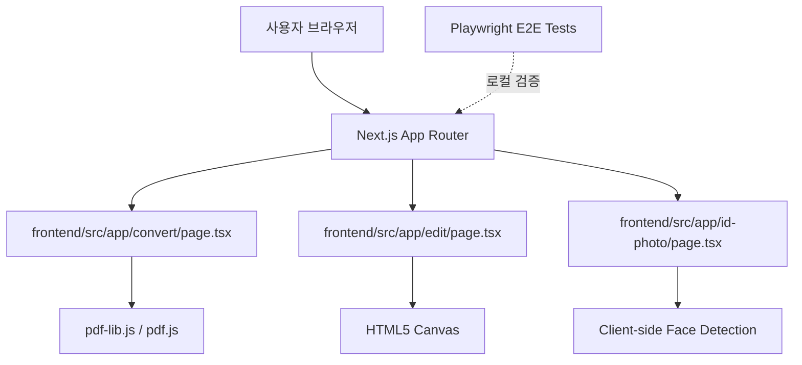

# Architecture Guide

이 문서 프로젝트는 100% 사용자 브라우저 안에서만 모든 문서 및 이미지 처리를 실행하도록 설계된 클라이언트 사이드 도구 모음(Next.js App Router)입니다.

## 아키텍처 개요 (Overview)

모든 PDF/이미지 처리 logic은 서버(Node.js 등) 백엔드를 거치지 않고, Web Worker, WASM, 혹은 브라우저 내 HTML5 canvas 및 client-side library를 통해 처리됩니다.

## 핵심 모듈 및 구성 요소

1. **Next.js frontend**: `frontend/` 디렉터리에 독립된 Next.js 프로젝트로 빌드되어 있습니다.
2. **Local Feature Routings**: `frontend/src/app` 내 각 서브 디렉터리가 각 도구(tool)의 라우터 역할을 합니다.
3. **E2E Test Suites**: `frontend/tests/` 내에서 Playwright를 이용하여 UI 업로드, 다운로드, 변환 로직 전체를 100% 로컬 브라우저 상에서 시뮬레이션하고 테스트합니다.

## 모듈 간 의존성 (Cross-Module Dependencies)

- **UI & Hooks**: `frontend/src/components`와 `frontend/src/hooks`는 공통 UI 및 상태(예: 로컬 스토리지 상태 저장)를 담당합니다.
- **Client-Side Workers**: 무거운 연산(PDF 파싱, 변환 등)은 브라우저의 메인 스레드를 블로킹하지 않기 위해 Web Worker 패턴으로 위임하거나 비동기 스트림으로 처리합니다.
