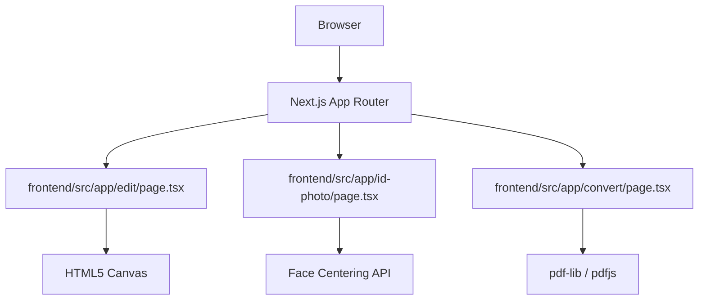

# Tools (Local Web PDF & Image Tools)

사용자 브라우저에서 100% 로컬로 실행되는 문서 및 이미지 처리 도구 모음입니다.

## Quick Commands

- **로컬 개발 서버 실행**: `npm run dev --prefix frontend` 또는 `cd frontend && npm run dev`
- **프로덕션 빌드**: `npm run build --prefix frontend`
- **E2E 테스트 실행**: `npm run test:e2e --prefix frontend` (Playwright)

## Key Files

- 메인 포털 진입점: [frontend/src/app/page.tsx](file:///C:/workspace/tools/frontend/src/app/page.tsx)
- PDF 편집 도구: [frontend/src/app/edit/page.tsx](file:///C:/workspace/tools/frontend/src/app/edit/page.tsx)
- 증명사진 도구: [frontend/src/app/id-photo/page.tsx](file:///C:/workspace/tools/frontend/src/app/id-photo/page.tsx)

## Architecture & Data Flow

모든 처리가 백엔드 없이 클라이언트 브라우저 내에서 직접 수행됩니다.

## Cross-Module Dependencies

- **frontend/src/components** -> UI 레이아웃 및 로컬 편집기 컴포넌트 제공.
- **frontend/src/hooks** -> 브라우저 로컬 저장소 캐시 및 편의 훅 기능 제공.
- **frontend/tests** -> Playwright E2E 검증 코드가 전체 도구 라우터를 타겟팅하여 테스트 수행.
